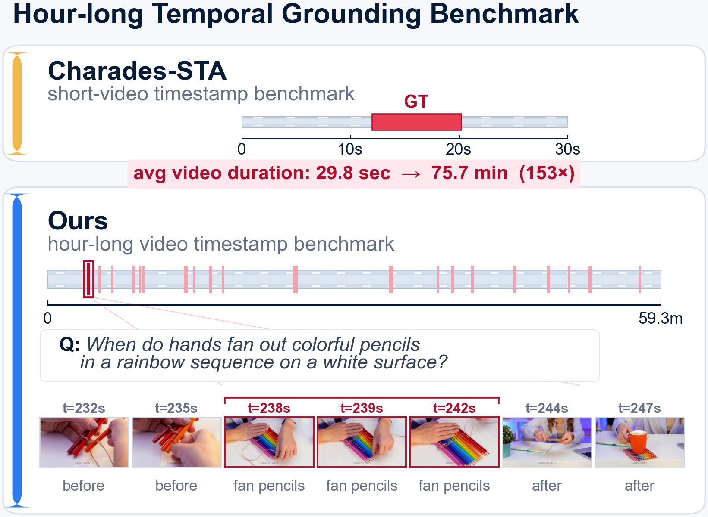
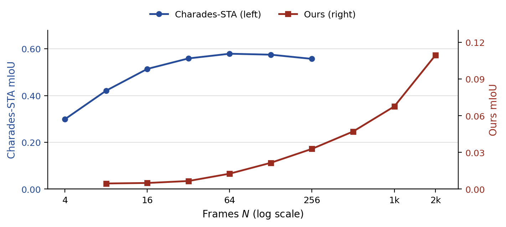

# ExtremeWhenBench

Hour-scale natural-language temporal grounding benchmark.

<p align="center">
  
</p>

**2,273 open-form natural-language questions** over **194 hour-long
videos** (mean 75.7 min, max 9 hr) sourced from LVBench, MLVU, and
VideoMME. The median GT event is 9 s — matched to Charades-STA's 7.1 s
— so the same event grain now sits inside a search space ~**153× larger**.

Companion to *Natural-Language Temporal Grounding in Hour-Long Videos is a
Search Problem: A Benchmark and Empirical Decomposition* —
[arXiv:2606.12300](https://arxiv.org/abs/2606.12300).

## Introduction

At hour-scale, the binding constraint is **search, not recognition**.
Video-LLMs are bottlenecked not by localizing a nearby event, but —
given a natural-language query — by finding the right region of a long
video. Short-video benchmarks (Charades-STA, ActivityNet Captions, …)
can't distinguish these failure modes because their search spaces are
too small; hour-scale grounding makes the distinction central and lets
the task decompose into a **search** stage and a **localize** stage —
structurally the *retrieve-then-read* split that reshaped open-domain QA.

## Results

Best per-model mIoU on Charades-STA vs. ExtremeWhenBench (same
natural-language temporal grounding task). Open Video-LLMs collapse
5–120×, and a frame-level CLIP retriever overtakes every open
Video-LLM in our compute budget:

| Model                          | Charades-STA | ExtremeWhenBench | Ratio |
| ------------------------------ | -----------: | ---------------: | ----: |
| **Qwen3.5-9B**                 |    **0.579** |        **0.110** |   5.3× |
| InternVL3.5-8B                 |        0.359 |            0.003 |    120× |
| LLaVA-OneVision-7B             |        0.226 |            0.003 |    75× |
| LLaVA-NextVideo-7B             |        0.089 |            0.001 |    89× |
| GPT-5.4 (64f)                  |        0.299 |            0.013 |    23× |
| Gemini-2.5-flash (1k f)        |        0.308 |            0.053 |   5.8× |
| Gemini-3.5-flash (auto-fps)    |        0.466 |            0.115 |   4.1× |
| **CLIP ViT-L/14-336** (retrieval) |    0.332 |        **0.269** |   1.2× |

CLIP **outperforms every open Video-LLM on ours** while sitting in the
middle of the pack on Charades-STA — the order flips when search
dominates. Failure taxonomy attributes **85%** of Video-LLM errors to
search; a retrieve-then-ground hybrid recovers **6.7×** over the
monolithic Video-LLM.

Scaling frames alone doesn't close the gap — Qwen3.5-9B keeps climbing
out to N=2,048 frames but remains far below the retrieval baseline:

<p align="center">
  
</p>

## What's released

- **Annotations**: published on Hugging Face as
  [`min1321/extreme-when-bench`](https://huggingface.co/datasets/min1321/extreme-when-bench).
- **Evaluation**: a reference vLLM script (`evaluation/`) and a drop-in
  [lmms-eval](https://github.com/EvolvingLMMs-Lab/lmms-eval) task
  (`lmms-eval/`).
- **Videos**: download from LVBench / MLVU / VideoMME (see below);
  we don't redistribute them.

Queries are **open-form natural language**, not template-bound:
MATTR 0.78 vs. 0.60 (TVBench) and 0.54 (Charades-STA); 1,578 unique
4-gram stems — a ~25× per-question gap over TVBench, whose 5 prefixes
cover 99.9% of its split.

## Benchmark

One row per question (loaded via `datasets.load_dataset("min1321/extreme-when-bench")`):

```json
{
  "qid": "-WnyRMZqV1U_q042",
  "video_id": "-WnyRMZqV1U",
  "source_corpus": "VideoMME",
  "question": "When does an elderly woman with round glasses speak into a microphone?",
  "correct_interval": [1805, 1822],
  "duration_s": 17,
  "video_duration_s": 4271,
  "category": "reaction"
}
```

Predictions are `[start, end]` intervals in seconds. Metrics: **mIoU**,
**R@0.3 / R@0.5 / R@0.7**, **parse-failure rate**. Parse failures count as
IoU = 0 (strict).

## Source videos

Download each of the 194 videos from its source corpus:

| Corpus    | Videos | Where to get it                                   |
| --------- | -----: | ------------------------------------------------- |
| VideoMME  |     89 | <https://video-mme.github.io/>                    |
| LVBench   |     67 | <https://lvbench.github.io/>                      |
| MLVU      |     38 | <https://github.com/JUNJIE99/MLVU>                |

VideoMME and LVBench `video_id`s are YouTube IDs
(`https://www.youtube.com/watch?v={video_id}`); MLVU ids are clip-named.
The HF dataset's `source_corpus`, `youtube_url`, and `video_duration_s`
columns give you the per-video lookup. After downloading, place each
file as `./videos/{video_id}.mp4`.

## Evaluation

### A. Reference script (matches paper Table 4)

vLLM serves the model; a small async OpenAI client streams video URLs.
This is the canonical no-think, video-mode run reported in the paper.

```bash
# Serve Qwen3.5-9B with vLLM (in another shell)
vllm serve <Qwen3.5-9B-checkpoint> --port 8000 \
    --served-model-name qwen3.5-9b \
    --tensor-parallel-size 8 --reasoning-parser qwen3 \
    --allowed-local-media-path ./videos

# Run the eval (questions are pulled from HF by default)
python evaluation/eval_qwen35_vllm.py \
    --video-dir ./videos \
    --num-frames 768 \
    --out       qwen35_f768.jsonl
```

Reported numbers (Qwen3.5-9B, `num_frames=768`, `enable_thinking=False`):

| Path                                       | mIoU   |
| ------------------------------------------ | ------ |
| Paper Table 4 (reported)                   | 0.053  |
| `evaluation/eval_qwen35_vllm.py` (this)    | 0.0469 |
| `lmms-eval` task (Section B below)         | 0.0485 |

### B. lmms-eval task

Drop the task plugin and the adapter patch from `lmms-eval/` into your
local lmms-eval clone:

```bash
git clone https://github.com/EvolvingLMMs-Lab/lmms-eval
cp -r ExtremeWhenBench/lmms-eval/extremewhenbench  lmms-eval/lmms_eval/tasks/
cp    ExtremeWhenBench/lmms-eval/patches/chat_openai.py \
      lmms-eval/lmms_eval/models/chat/openai.py
```

Then run `lmms-eval --tasks extremewhenbench` with the recommended flags
(`pass_video_url=True`, `enable_thinking_kwarg=False`,
`max_frames_num=768`); the full command is in `lmms-eval/README.md`.

The adapter patch is a small two-flag opt-in that makes lmms-eval's
`openai` adapter send video as a URL so vLLM decodes server-side —
without it, mIoU on hour-long inputs drops ~10× because client-side
frame extraction strips absolute-time signals. We plan to upstream the
patch + task as a PR to `EvolvingLMMs-Lab/lmms-eval`; until that lands,
the drop-in above is the way to use them.

## Repo layout

```
ExtremeWhenBench/
├── evaluation/
│   └── eval_qwen35_vllm.py    # paper's reference run (loads HF dataset)
└── lmms-eval/
    ├── README.md              # how to use with lmms-eval
    ├── extremewhenbench/      # drop-in task (yaml + utils + README)
    └── patches/chat_openai.py # patched openai adapter (companion PR)
```

## Citation

```bibtex
@article{seo2026extremewhenbench,
  title   = {Natural-Language Temporal Grounding in Hour-Long Videos
             is a Search Problem: A Benchmark and Empirical Decomposition},
  author  = {Seo, Sukmin and Kim, Geewook},
  journal = {arXiv preprint arXiv:2606.12300},
  year    = {2026}
}
```

## License

Code in this repo: Apache-2.0.

```
ExtremeWhenBench
Copyright (c) 2026-present NAVER Cloud Corp.

Licensed under the Apache License, Version 2.0 (the "License");
you may not use this file except in compliance with the License.
You may obtain a copy of the License at

    http://www.apache.org/licenses/LICENSE-2.0

Unless required by applicable law or agreed to in writing, software
distributed under the License is distributed on an "AS IS" BASIS,
WITHOUT WARRANTIES OR CONDITIONS OF ANY KIND, either express or implied.
See the License for the specific language governing permissions and
limitations under the License.
```

Annotations on Hugging Face
([`min1321/extreme-when-bench`](https://huggingface.co/datasets/min1321/extreme-when-bench)):
CC-BY-4.0. Source videos are governed by the licenses of LVBench, MLVU,
and VideoMME respectively; we do not redistribute them.

See `NOTICE` for third-party attributions.
